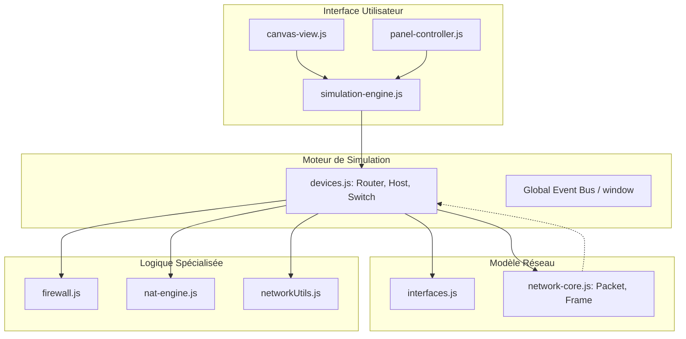

## Nesiin v1.0 - Simulateur Réseau Pédagogique

## Utilisation

1. Ouvrez `index.html` dans un navigateur moderne.
2. Sélectionnez un scénario dans le menu des défis.
3. Utilisez la console intégrée sur les hôtes pour lancer des commandes (`ping`, `show ip route`, `arp -a`).
4. Observez le déplacement des paquets en temps réel ou pas-à-pas dans le mode Simulation.

## Nesiin v1.1 - Simulateur Réseau Pédagogique

orienté objet, conçu pour illustrer le parcours d'un paquet à travers les couches du modèle OSI (L2/L3).
privilégie la visibilité du code et des concepts modélisés sur la performance brute ou la conformité exhaustive aux RFC.

## Socle réseau simulé

- **Couche 2** : Ethernet, ARP, Table MAC, Flooding.
- **Couche 3** : IPv4, LPM, TTL, ICMP (Echo, Unreachable, Time Exceeded).
- **Routage Dynamique** : 
    - RIP (Vecteur de distance, métriques).
    - OSPF (État de lien, calcul de coût dynamique par type de média).
- **Sécurité & Translation** :
    - Firewall ACL (Ordre séquentiel, Default Policy).
    - NAT Statique 1:1 (Bijectif, filtrage des flux entrants non mappés).

### Composants Clés
- **SimulationEngine** : Le chef d'orchestre. Il gère la file d'attente des trames (L2) et la chronologie des événements (Ticks).
- **Router** : Implémente un pipeline de traitement complet (DNAT -> ACL Ingress -> Routing -> TTL -> ACL Egress -> SNAT).
- **Packet & Frame** : Objets immuables représentant les données circulant sur le réseau.
- **NetworkUtils** : Source de vérité unique pour les calculs de sous-réseaux et la normalisation IPv4.

## Pipeline de Traitement L3

1. **Ingress (L2)** : Décapsulation de la Frame.
2. **Pre-Routing (DNAT)** : Consultation du `StaticNATEngine`. Si Destination IP est publique, translation vers IP Privée.
3. **Ingress ACL** : Filtrage par le `Firewall` sur l'IP de destination réelle (après translation).
4. **Routing Decision** : Longest Prefix Match (LPM) dans la table de routage.
5. **TTL Check** : Décrémentation. Si 0 -> Génération ICMP Time Exceeded.
6. **Egress ACL** : Filtrage final avant sortie.
7. **Post-Routing (SNAT)** : Si Source IP est privée, translation vers IP Publique.
8. **Forwarding (L2)** : Encapsulation et envoi vers l'interface de sortie.

## Diagramme Logique

## Scénarios

### Niveau 2 (Liaison)
- Apprentissage des tables MAC sur les Switches.
- Diffusion (Flooding) et Unicast.
- Protocole ARP (Requêtes/Réponses).

### Niveau 3 (Réseau)
- Routage IPv4 par *Longest Prefix Match* (LPM).
- Protocoles de routage dynamique :
  - **RIP** (Vecteur de distance, métriques, Split Horizon).
  - **OSPF** (État de lien, calcul de coût basé sur le média, LSAs).
- ICMP : Diagnostic réseau (Echo, Destination Unreachable, Time Exceeded).

### Sécurité et Services

- **ACL / Firewall** : Filtrage séquentiel par IP, masque et protocoles.
- **NAT (Network Address Translation)** : Translation statique pour l'accès Internet et la publication de services.

Attention : Firewall est sur le Routeur (réalisme) donc flux à expliquer (à ce prix).

## Tests et Qualité

Le projet inclut une suite de tests unitaires et d'intégration (situés dans `/src/js/tests/`) couvrant :
- La validation des formats d'adresses.
- La convergence des tables de routage après une panne de lien.
- La bijectivité des règles NAT.
